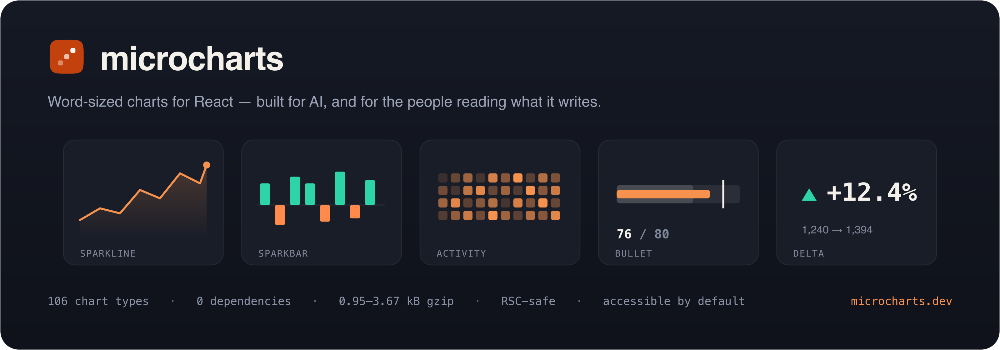

<div align="center">



# @microcharts/react

**Word-sized charts for React** — zero runtime dependencies, ~1–3&nbsp;kB gzip each, accessible by default, and
server-component safe.

<br>

[](https://www.npmjs.com/package/@microcharts/react)
[](https://microcharts.dev/docs/performance)
[](https://microcharts.dev)
[](https://microcharts.dev)
[](https://microcharts.dev/docs/quickstart)
[](./LICENSE)
[](https://argos-ci.com?utm_source=ganapativs/microcharts&utm_campaign=oss)

**[Docs](https://microcharts.dev)** · **[Gallery](https://microcharts.dev/docs/charts)** ·
**[Quickstart](https://microcharts.dev/docs/quickstart)** · **[AI usage](https://microcharts.dev/docs/ai)** ·
**[llms.txt](https://microcharts.dev/llms.txt)**

</div>

---

microcharts is **106 tiny, handcrafted chart types** built to sit _inside_ an interface — in a sentence, a table cell, a
KPI card, a tab header, a streamed AI reply — where a full chart library would be too heavy and too loud. One quiet
signal, read at a glance.

The grammar is small enough for a model to emit correctly mid-sentence, and every chart describes itself in words. So a
chart an LLM streams into a chat reply is one a person can read and trust — the properties that make it safe for a model
to write are the ones that make it pleasant for a human to use.

> **Status: production-ready, still earning its scars.** microcharts is tested and ready to use in production, but it
> hasn't been battle-tested across every stack and edge yet — you may hit the occasional rough edge. When you do, tell
> us: bug reports and feature requests on [GitHub issues](https://github.com/ganapativs/microcharts/issues) are how it
> keeps getting sharper.

## Why

- **AI-native.** A chart is plain `data` plus a generated sentence. One grammar across all 106 types — a model that has
  seen one chart can write them all. → [AI usage](https://microcharts.dev/docs/ai)
- **Zero dependencies.** No chart engine, no D3 — just SVG. React is the only peer. CI-enforced, forever.
- **Server-component safe.** Static charts are hook-free and render to HTML with **zero client JavaScript**.
  Interactivity is a separate opt-in `/interactive` import.
- **Accessible by default.** Every chart is an `img` with a natural-language summary built from your data — nothing to
  remember, nothing to drift. → [Accessibility](https://microcharts.dev/docs/accessibility)
- **Tiny + honest.** **0.95–3.67 kB gzip** per chart (median 2.33; 23 of 106 under 2 kB), budget-gated in CI. Every type
  has one documented, honest encoding channel. Delight never lies.

## Install

```bash
npm install @microcharts/react
```

Import the stylesheet **once** at the root of your app — it carries every theming token and chart style in a
low-specificity cascade layer, so your own styles always win:

```tsx
// app/layout.tsx
import "@microcharts/react/styles.css";
```

## Your first chart

Every chart renders from `data` alone. This works in a **React Server Component** with zero client JavaScript — pure
SVG, and its accessible name is generated from the data.

```tsx
import { Sparkline } from "@microcharts/react/sparkline";

<Sparkline data={[3, 5, 4, 8, 6, 9]} title="Weekly revenue" />;
```

Each chart imports from its **own subpath**, so you only ship what you use. Nearly every chart follows the same
two-entry pattern: a static default, and an `/interactive` twin (`WindBarb` is the lone static-only exception).

## Add interactivity

Need hover, keyboard navigation, touch, or live announcements? Import the same chart from `/interactive`. The rendered
output and the accessible name are identical — the interactive entry composes its static twin — and it **adds** props
rather than changing any: you opt into the client component where it matters.

```tsx
import { Sparkline } from "@microcharts/react/sparkline/interactive";

<Sparkline data={[3, 5, 4, 8, 6, 9]} title="Weekly revenue" />;
```

Every interactive chart shares one contract, so you learn it once. Hover or arrow keys make a unit **active**; a click,
tap, <kbd>Enter</kbd>, or <kbd>Space</kbd> **selects** it and pins the readout so it survives blur; <kbd>Escape</kbd>
clears; <kbd>Home</kbd>/<kbd>End</kbd> jump to the ends. Read it back with `onActive` and `onSelect` — payload
`{ index, value, label? }` — and control the pin with `selectedIndex` / `defaultSelectedIndex`. Single-unit scalar
charts (Delta, Progress, StatusDot, Bullet, …) take `onSelect` alone.

```tsx
<Sparkline data={[3, 5, 4, 8, 6, 9]} onActive={(d) => setHovered(d?.value ?? null)} onSelect={(d) => pin(d)} />
```

## Annotate with children

Thresholds, markers, and target zones are **children** — the same grammar on every chart that supports them:

```tsx
import { Sparkline } from "@microcharts/react/sparkline";
import { Threshold, Marker } from "@microcharts/react/annotations";

<Sparkline data={[120, 180, 240, 210, 260]} title="Latency p95">
  <Threshold y={200} label="SLO" />
  <Marker x={2} celebrate />
</Sparkline>;
```

## Theme it

About two dozen `--mc-*` CSS custom properties are the runtime contract; presets are token bundles. Set one on a subtree
with the provider — presets are visual only and never change what the data means:

```tsx
import { MicroProvider } from "@microcharts/react";

<MicroProvider theme="editorial">
  <Sparkline data={[3, 5, 4, 8, 6, 9]} />
</MicroProvider>;
```

Presets: `modern` (default), `editorial`, `mono`, `vivid`, plus output-context `print` and `eink`. Dark mode is
hand-tuned, not inverted. For a whole brand theme, `defineTheme` (from `@microcharts/react/theme`) derives a matched,
colour-blind-safe palette and dark twins from one accent:

```tsx
import { defineTheme } from "@microcharts/react/theme";

const brand = defineTheme({ accent: "#6d28d9" });
<MicroProvider style={brand.style}>…</MicroProvider>;
```

Retune density with one scalar (`--mc-density`), give figures their own face (`--mc-font-numeric`), or recolour a single
categorical chart with a `colors` array. → [Theming guide](https://microcharts.dev/docs/theming)

## The catalog

**106 stable chart types** — 34 core, 26 decision, 23 expressive, 23 frontier — grouped by the _question_ each one
answers. `data` alone always renders something correct, and a prop name means the same thing on every chart (`domain`,
`color`, `title`, `summary`, `label`, `format`…), so you pick by the decision you need read, not by fighting an options
bag.

Sparklines, bars, deltas, and bullets through bump charts, funnels, honeycombs, calendar strips, and confidence bands —
**[browse them all in the live gallery →](https://microcharts.dev/docs/charts)**

> **Not shipping, on purpose:** pie, needle-gauge/speedometer, battery, waffle, violin. Each fails at micro scale or on
> the honest-encoding bar, and each has a strictly-better in-catalog replacement (Bullet for gauges, SegmentedBar for
> pie, MicroBox for violin). → [what to use instead](https://microcharts.dev/llms.txt)

## Made for models

microcharts is built to be written _by_ an LLM and read _by_ a person. The docs site publishes machine surfaces
alongside the human ones:

| Surface                                                   | What it is                                          |
| --------------------------------------------------------- | --------------------------------------------------- |
| [`/llms.txt`](https://microcharts.dev/llms.txt)           | Curated map of the catalog and guides               |
| [`/llms-full.txt`](https://microcharts.dev/llms-full.txt) | The complete generated docs corpus                  |
| [`/catalog.json`](https://microcharts.dev/catalog.json)   | Every chart's name, import path, props, data shapes |

## Compatibility

React **18 and 19**. ESM-only, per-component subpath exports, types-first export conditions. Static charts render in any
RSC or SSR setup with no client runtime.

`sideEffects` is a two-entry allowlist rather than `false`, because `styles.css` and the opt-in `./motion` engine are
both imported for their side effects and `false` would let a bundler drop them. Every other module is side-effect free
and tree-shakes normally — and since charts ship as per-component subpaths, you only ever pay for the ones you import.

## Contributing

```bash
pnpm install
pnpm check     # typecheck + lint + format + test + knip + sizes
pnpm build
```

See [CONTRIBUTING.md](./CONTRIBUTING.md). Issues and ideas welcome — new chart types are held to a high bar (≤ 200×60
px, a unique data story, an honest channel, readable without training).

## License

[MIT](./LICENSE) © [Ganapati V S](https://meetguns.com)
